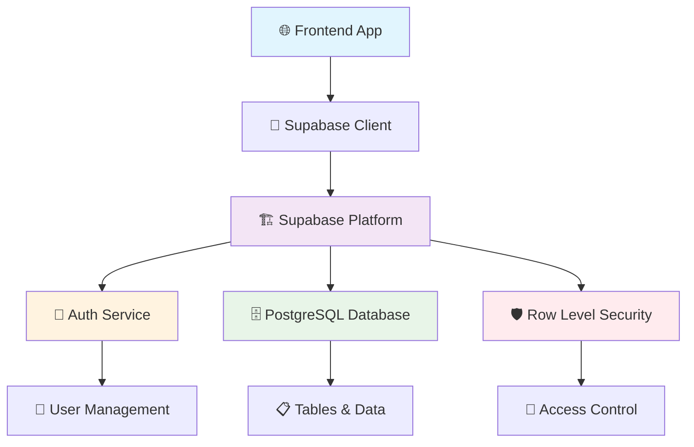
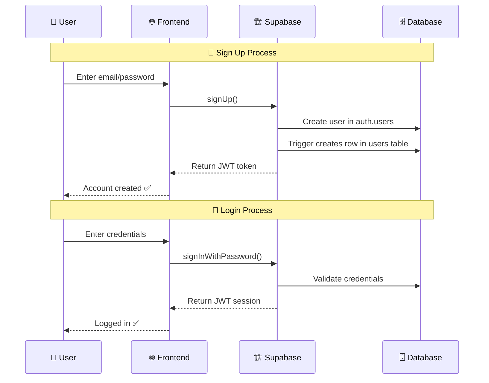
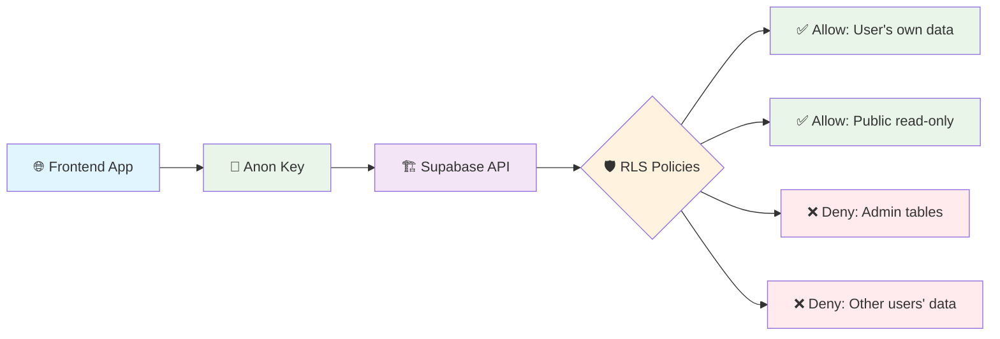
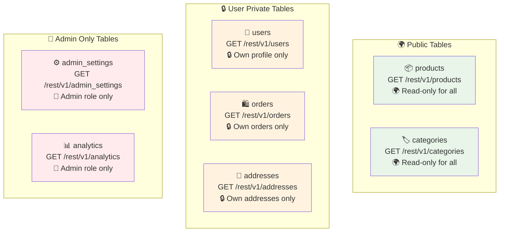

# 🚀 **Frontend Guide – Connecting & Using Supabase with Anon Key**

This guide explains **exactly** how to connect a frontend application to the Supabase database **using the public anon key** and **project URL**, then perform **authentication**, **fetch**, **insert**, and **update** operations.

---

## 📊 **Architecture Overview**



---

## 🔧 **1. Install the Supabase Client Library**

The easiest way to talk to Supabase from your frontend is by using its JavaScript client library.

```bash
# 📦 Using npm
npm install @supabase/supabase-js

# 🧶 Using yarn  
yarn add @supabase/supabase-js
```

---

## ⚙️ **2. Create the Supabase Client**

Inside your frontend project, create a file named **`supabaseClient.js`**.
This file will store the connection settings to your Supabase project.

```javascript
import { createClient } from '@supabase/supabase-js'

// 🔗 Paste your details from Supabase Dashboard → Settings → API
const SUPABASE_URL = 'https://YOUR-PROJECT-ID.supabase.co'
const SUPABASE_ANON_KEY = 'YOUR-ANON-KEY'

// 🌟 Create a single Supabase client for the whole app
export const supabase = createClient(SUPABASE_URL, SUPABASE_ANON_KEY)
```

### 📝 **Configuration Details**
- **`SUPABASE_URL`** → Your unique project URL
- **`SUPABASE_ANON_KEY`** → Public key used in the frontend
- The anon key is **safe** to use in the frontend because **Row Level Security (RLS)** in the database enforces who can see or change data

---

## 🔐 **Authentication Flow**



---

## 📝 **3. Sign Up a New User**

When a new user signs up, Supabase Auth automatically:

1. ✨ Creates a user in **`auth.users`** (Supabase's internal auth table)
2. 🔄 Creates a matching row in your **`users`** table (via the trigger we set in the migration)
3. 🎫 Generates a JWT token for the user (used for RLS checks)

```javascript
const { data, error } = await supabase.auth.signUp({
  email: 'john@example.com',
  password: 'StrongPassword123',
  options: {
    data: { name: 'John Doe' } // 💾 Stored in raw_user_meta_data
  }
})

if (error) {
  console.error('❌ Signup failed:', error.message)
} else {
  console.log('✅ Signup success:', data)
}
```

---

## 🔑 **4. Login (Sign In)**

Once registered, the user can log in to get a session with a JWT.

```javascript
const { data, error } = await supabase.auth.signInWithPassword({
  email: 'john@example.com',
  password: 'StrongPassword123'
})

if (error) {
  console.error('❌ Login failed:', error.message)
} else {
  console.log('✅ Logged in successfully:', data)
}
```

> 🔒 This session token is stored internally by Supabase JS and will be used in **every query** to check permissions.

---

## 📖 **5. Fetching Data**

### 🌍 **Public Table Example – `products`**

Anyone can read products, even without logging in.

```javascript
const { data, error } = await supabase
  .from('products')
  .select('*')

if (error) {
  console.error('❌ Error fetching products:', error.message)
} else {
  console.log('📦 Products:', data)
}
```

### 🔒 **Private Table Example – `orders`**

Only logged-in users can see their own orders.

```javascript
const { data, error } = await supabase
  .from('orders')
  .select('*')

if (error) {
  console.error('❌ Error fetching orders:', error.message)
} else {
  console.log('🛍️ My orders:', data)
}
```

---

## ➕ **6. Inserting Data**

Example – Add a new address for the logged-in user.

```javascript
const { data, error } = await supabase
  .from('addresses')
  .insert([
    {
      label: 'Home',
      street: '123 Main Street',
      city: 'New York',
      state: 'NY',
      postal_code: '10001',
      country: 'USA',
      is_default: true
    }
  ])

if (error) {
  console.error('❌ Error adding address:', error.message)
} else {
  console.log('✅ Address added:', data)
}
```

---

## ✏️ **7. Updating Data**

Example – Change the name of the logged-in user.

```javascript
const { data, error } = await supabase
  .from('users')
  .update({ name: 'Johnny Doe' })
  .eq('id', (await supabase.auth.getUser()).data.user.id)

if (error) {
  console.error('❌ Error updating name:', error.message)
} else {
  console.log('✅ Profile updated:', data)
}
```

---

## 🗑️ **8. Deleting Data**

Example – Delete one of your addresses.

```javascript
const { error } = await supabase
  .from('addresses')
  .delete()
  .eq('id', 'ADDRESS-UUID')

if (error) {
  console.error('❌ Error deleting address:', error.message)
} else {
  console.log('✅ Address deleted')
}
```

---

## 🚪 **9. Logout**

End the current user session:

```javascript
const { error } = await supabase.auth.signOut()

if (error) {
  console.error('❌ Error logging out:', error.message)
} else {
  console.log('👋 User logged out')
}
```

---

## 🌐 **10. Using the REST API Without JS**

Every table can also be accessed via a REST URL.

### 📋 **API Format**
```
https://YOUR-PROJECT-ID.supabase.co/rest/v1/<table_name>
```

### 🔍 **Example – Fetch all products:**
```bash
curl "https://YOUR-PROJECT-ID.supabase.co/rest/v1/products" \
  -H "apikey: YOUR-ANON-KEY" \
  -H "Authorization: Bearer YOUR-ANON-KEY"
```

### 🛍️ **Example – Fetch logged-in user's orders:**
```bash
curl "https://YOUR-PROJECT-ID.supabase.co/rest/v1/orders" \
  -H "apikey: YOUR-ANON-KEY" \
  -H "Authorization: Bearer ACCESS_TOKEN"
```

> ⚠️ Replace `ACCESS_TOKEN` with JWT from login

---

## 🛡️ **11. Security Overview**



### 🔐 **Security Features**
- ✅ **Anon key** is public — safe to embed in frontend code
- 🛡️ **RLS policies** in the migration ensure:
  - Users can only see/update their own data
  - Admin-only tables are restricted to `role = 'admin'`
  - Public tables like `products` are read-only for everyone
- ⚠️ **Never expose your service_role key** in frontend code

---

## 🗺️ **API Table Map**



---

## 🎯 **Quick Reference**

| Operation | Emoji | Method | Example |
|-----------|-------|--------|---------|
| **Read** | 📖 | `.select()` | `supabase.from('table').select('*')` |
| **Create** | ➕ | `.insert()` | `supabase.from('table').insert([data])` |
| **Update** | ✏️ | `.update()` | `supabase.from('table').update(data).eq('id', id)` |
| **Delete** | 🗑️ | `.delete()` | `supabase.from('table').delete().eq('id', id)` |
| **Sign Up** | 📝 | `.signUp()` | `supabase.auth.signUp({email, password})` |
| **Sign In** | 🔑 | `.signInWithPassword()` | `supabase.auth.signInWithPassword({email, password})` |
| **Sign Out** | 🚪 | `.signOut()` | `supabase.auth.signOut()` |

---

